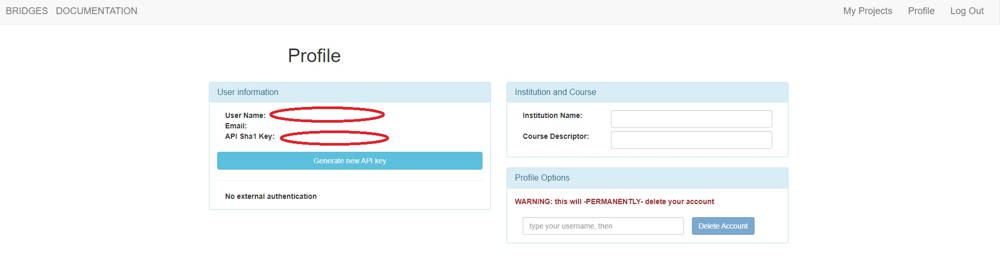

# Introduction about [bridges-games](http://bridges-games.herokuapp.com/)
BRIDGES can easily help you to start out the python in a interesting way  
Link: [The official tutorial](https://bridgesuncc.github.io/tutorials/NonBlockingGame.html)  
## How to prepare environment?
You should install bridges packages by `pip3 install bridges` or `conda install bridges`in Anaconda prompt  
Or you can follow [BRIDGES official guideline](https://bridgesuncc.github.io/bridges_setup.html)  
## The parameter in my code
There are some parameters in my code you should change by yourself  
Such as `my_game = BugStomp(219, "User Name", "API Key", 30, 30)` or `game = RaceCar(221, "User Name", "API Key")`  
`User Name` and `API Key` are belongs to your BRIDGES account  
  
  

# Game1: BUGSTOMP.py   
Bugstomp is a very simple game on a 30x30 grid, where the background is all black and all symbols are white. The character controlled by the player is shown using the 'man' symbol and the bug to stomp is shown using the 'bug3' symbol.  
  
This is a game about man catching a bug by using :arrow_up_small::arrow_down_small::arrow_backward::arrow_forward: 
When the man touch the bug, you will get 1 point  
The game will end when you get 10 points  
>[!NOTE]
> Of course you can adjust parameter by yourself!  
  
